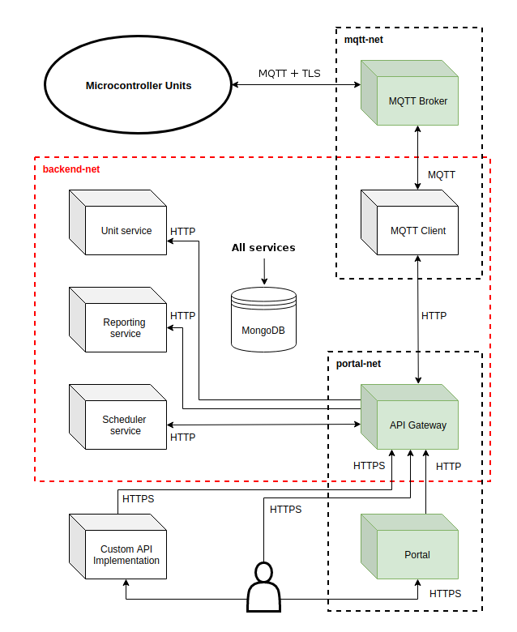

# iot-project-summary

## Project
This is a general purpose IoT service with the aim to flexibly handle any Micro Controller Unit(MCU) that implements its
MCU side API, agnostic to the language, hardware and even hardware modules of these Units. 

It provides monitoring, control, automation and reporting services and exposes a REST/RPC API to the end consumers.
A portal is also in the making to have a more convenient access to the services, but it's still in its early days.

## History
In early 2018 I have started my sabbatical leave with the aim to recharge and to steer my carreer towards software development.
Fortunately these two have found parallel paths in more than one of my new hobbies, like indoor aeroponic gardening
or micro controllers. Eventually culminating in this project that I've started to handle the controllers in my own garden 
and still enjoy working on it, using it as a playground to learn new technologies.
I also try to develop and document it in a way that it might be useful for others.

## Technologies
Server side:
- Java 11
- Spring Boot 2.2.x
- Docker 19.x with Docker Swarm
- MongoDB 4.x
- Gradle 5.6
- JUnit 5
- Mosquitto MQTT broker 1.6
- a ton of bash magic for the deployment :)

MCU side:
- MicroPython 1.11
- ESP32 WROOM and WROVER micro controller modules
- Various relay and sensor modules 

## Security
- The services use Docker Secrets to store sensitive data. These secrets are loaded by a custom parser before each service
launches
- No sensitive data is passed directly through environment variables (that would be readable in the service info)
- All exposed endpoints are protected with TLS
- All docker networks are encrypted (the services communicate in plain http)

## Server side API 
The server side API is detailed at the [iot-api-gateway](https://github.com/tlvlp/iot-api-gateway) service

## MCU side API
The MCU side API is detailed at the [iot-mcu-modules](https://github.com/tlvlp/iot-mcu-modules) template

Units used in my own indoor garden can be found at:
- [BazsalikOn Soil](https://github.com/tlvlp/iot-mcu-bazsalikon-soil)
- [BazsalikOn Aero](https://github.com/tlvlp/iot-mcu-bazsalikon-aero)

## Deployment 
Deployment details can be found at the project's [iot-server-deployment](https://github.com/tlvlp/iot-server-deployment) repository

## Project Repositories
| Service | Details | |
| :--- | :--- | :--- |
| [iot-api-gateway](https://github.com/tlvlp/iot-api-gateway) | The main API for the project encapsulating the other services| Frontend |
| [iot-portal](https://github.com/tlvlp/iot-portal) | Unreleased - A heavily experimental Vaadin based implementation of the API | Frontend | 
| [iot-mqtt-client](https://github.com/tlvlp/iot-mqtt-client) | The back-end services' link to the MQTT broker and the MCUs | Frontend | 
| [iot-unit-service](https://github.com/tlvlp/iot-unit-service) | Implements the MCU side of the API, handling all Units | Backend |
| [iot-reporting-service](https://github.com/tlvlp/iot-reporting-service) | Stores input data and generates reports on demand | Backend |
| [iot-scheduler-service](https://github.com/tlvlp/iot-scheduler-service) | Stores and executes scheduled tasks in the form of API calls | Backend |
| [iot-server-deployment](https://github.com/tlvlp/iot-server-deployment) | Complete deployment and related details | Backend |
| [iot-mcu-modules](https://github.com/tlvlp/iot-mcu-modules) | The MCU side reference impl. / template | MCU |
| [BazsalikOn Soil](https://github.com/tlvlp/iot-mcu-bazsalikon-soil) | Custom microcontroller setup based on the mcu modules template | MCU |
| [BazsalikOn Aero](https://github.com/tlvlp/iot-mcu-bazsalikon-aero) | Custom microcontroller setup based on the mcu modules template | MCU |
| [MicroPython upload](https://github.com/tlvlp/micropython-upload) | Upload scripts for the MicroPython firmware and MCUs | MCU |

## Service calls overview

This diagram shows an overview of the possible API calls between the services.
All service except the MQTT broker uses the database so I have omitted the connections there for the sake of clarity.

The API Gateway controls most of the processes, but the MQTT Client and the Scheduler can also call the gateway via a
dedicated internal user account.

